# Retail Order Tracker

An AI-augmented EDI operations platform with human-in-the-loop review. Retailers (Carrefour, Leroy Merlin, El Corte Inglés, …) submit purchase orders in five formats (JSON, XML/Facturae 3.2.2, CSV, EDIFACT D.96A, PDF). The system parses each order, runs an AI **Analyst Agent** to suggest an action (approve / request clarification / escalate), and presents the suggestion to operators for review. Every operator decision becomes a labelled example in **Arize Phoenix**, closing the loop for evaluation and future fine-tuning.

Built as a portfolio project demonstrating clean-architecture FastAPI + LangChain tool-calling agents + self-hosted observability + n8n orchestration + a Vue 3 dashboard with live WebSocket updates.

---

## Demo


*End-to-end flow: login → dashboard → review queue → drill into a flagged order → submit feedback → toast broadcasts the status change in real time.*

---

## Architecture

```
                                    ┌─────────────────────────┐
                                    │   Vue 3 + shadcn-vue    │
                                    │   (Pinia, TanStack      │
                                    │    Query, vue-sonner)   │
                                    └──────────┬──────────────┘
                                               │ HTTP + WebSocket
                                               ▼
                                ┌──────────────────────────────┐
                                │   FastAPI (Python 3.13)      │
                                │   Clean architecture:        │
                                │   domain → application →     │
                                │   infrastructure → api       │
                                └──┬──────────┬──────────┬─────┘
                                   │          │          │
                ┌──────────────────┘          │          └──────────────────┐
                ▼                             ▼                             ▼
       ┌──────────────────┐         ┌─────────────────┐           ┌──────────────────┐
       │   Parsers (5)    │         │   AI Agents     │           │  Persistence     │
       │ JSON / XML / CSV │         │ Parser Agent    │           │  Postgres 16     │
       │ EDIFACT (pydifact)│        │  (PDF only,     │           │  + Alembic       │
       │ PDF → Parser     │         │   multimodal)   │           │  + asyncpg       │
       │   Agent          │         │ Analyst Agent   │           └──────────────────┘
       └──────────────────┘         │  (every order,  │
                                    │   tool calling) │           ┌──────────────────┐
                                    └────────┬────────┘           │     MinIO        │
                                             │                    │ (S3-compatible,  │
                                             │ OTLP traces        │  raw uploads)    │
                                             ▼                    └──────────────────┘
                                  ┌─────────────────────┐
                                  │  Arize Phoenix      │
                                  │  (self-hosted       │      ┌──────────────────────┐
                                  │   observability +   │      │       n8n            │
                                  │   evaluators +      │      │  (4 workflows: new   │
                                  │   labelled datasets)│      │   order, daily report,│
                                  └─────────────────────┘      │   escalation,        │
                                                               │   retraining)        │
                                                               └──────────────────────┘
```

**Layered (Hexagonal / Ports & Adapters) backend** — `domain/` has zero external dependencies (entities, value objects, business rules), `application/` defines abstract ports + use cases, `infrastructure/` provides adapters (parsers, agents, MinIO, SQLAlchemy, Phoenix). The `api/` layer is a thin FastAPI shell on top.

**8 containers in the full stack** (`docker compose up`): `postgres`, `minio` + `minio-init`, `phoenix`, `n8n` + `n8n-init`, `api`, `web`. The two `*-init` services are one-shots that create the MinIO bucket and import the n8n workflows.

---

## Tech Stack

| Layer | Technology |
|-------|------------|
| **Backend** | Python 3.13, FastAPI, Uvicorn, Pydantic v2 |
| **Database** | PostgreSQL 16 with `asyncpg` driver |
| **ORM / Migrations** | SQLAlchemy 2.x async, Alembic |
| **AI framework** | LangChain (tool calling, structured output) |
| **AI provider** | Anthropic Claude (`claude-sonnet-4-6` for both agents) |
| **Observability** | Arize Phoenix (self-hosted, OTLP/HTTP on port 6006) |
| **Object storage** | MinIO (S3-compatible) — original uploaded files |
| **Frontend** | Vue 3.5 (Composition API), Vite 6, TypeScript 5.6 strict |
| **UI** | shadcn-vue (Radix primitives), Tailwind CSS v4, lucide-vue-next |
| **Client state** | Pinia 2 |
| **Server state** | TanStack Query for Vue 5 |
| **WebSocket** | `@vueuse/core` `useWebSocket` |
| **Toast** | vue-sonner |
| **Workflow orchestration** | n8n (latest) |
| **Auth** | JWT (PyJWT, in-memory user store — demo scope) |
| **Backend testing** | pytest, pytest-asyncio, httpx ASGITransport |
| **Frontend testing** | Vitest, @vue/test-utils, jsdom |
| **Linting** | ruff (Python), ESLint 9 flat config (TS / Vue) |
| **Package managers** | uv (Python), npm (JS) |
| **Infrastructure** | Docker Compose (8 containers full stack, 4 + 1 init in infra-only mode) |

---

## How to Run

```bash
git clone https://github.com/peelmicro/retail-order-tracker.git
cd retail-order-tracker
cp .env.example .env
# Edit .env and set ANTHROPIC_API_KEY=sk-ant-...   (required for both agents)
```

### Option 1 — Docker Compose (recommended)

No local Python/Node install needed. Everything runs in containers.

```bash
docker compose up -d --build
```

This starts:
- **Postgres** on `5432`
- **MinIO** on `9000` (console: http://localhost:9001, login `minioadmin` / `minioadmin`)
- **Phoenix** on http://localhost:6006
- **n8n** on http://localhost:5678 (no sign-in — `N8N_USER_MANAGEMENT_DISABLED=true` is set in `docker-compose.yml` for demo convenience; never do this in production)
- **API** on http://localhost:8000 (Swagger: http://localhost:8000/docs)
- **Web** on http://localhost:5173

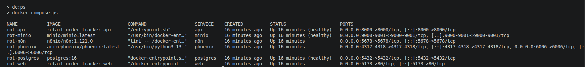
*All 8 containers reach `Up (healthy)` within ~30s. The API runs `alembic upgrade head` on entrypoint, `minio-init` creates the `orders` bucket, and `n8n-init` imports the 4 workflows.*

> **Outside Spain?** The default `BASE_REGISTRY=mirror.gcr.io/library` resolves the LaLiga / Cloudflare R2 block that Spanish ISPs apply during football matches. Override with `BASE_REGISTRY=docker.io/library` in `.env` to pull from Docker Hub directly.

### Option 2 — Local development (infra in Docker, API + Web on host)

Faster inner loop — code changes hot-reload without a container rebuild.

**Prerequisites:** Python 3.13, Node.js 24+, Docker.

```bash
# 1) Bring up just the 4 infra containers
npm run dc:up:infra

# 2) Set up the API
cd apps/api
uv venv && uv pip install -r requirements.txt
.venv/bin/alembic upgrade head
cd ../..
npm run api                           # starts FastAPI on :8000 with hot reload

# 3) Set up the Web (in another terminal)
cd apps/web && npm install && cd ../..
npm run web                           # starts Vite on :5173
```

### Populate data

The seed endpoint creates retailers + suppliers + a small batch of synthetic historical orders + a few pending orders + a few feedback rows so the dashboard, queue, and Phoenix dataset all show non-empty data. Default counts (20 historical, 5 pending, 5 feedbacks) take ~3 s.

```bash
npm run initial-seed              # smaller demo batch (default)
HIST=200 PEND=30 FB=50 npm run initial-seed   # larger
```

Internally this calls `POST /api/seed` after logging in as admin — see [scripts/initial-seed.sh](scripts/initial-seed.sh) and the recipes in [apps/api/http/seed.http](apps/api/http/seed.http).

The seed **does not** run the Analyst Agent automatically — orders are created without suggestions, and the operator triggers analysis on demand from the Review Queue (per-row `Run analysis` button). To deterministically produce an `escalate` candidate, run:

```bash
npm run demo:upload
```

This uploads a deliberately-anomalous order (50,000 × €99,999 leather handbags from a foods supplier — absurd category mismatch + total ≈ €5B). When you click `Run analysis` in the Review Queue, Claude reliably flags it as `escalate` at confidence ≥ 0.9 with several specific anomalies.

Login as `admin` / `admin123` (write access) or `operator` / `operator123` (read + feedback only).

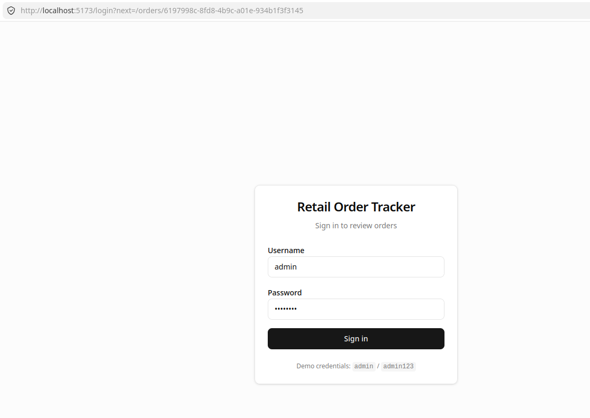
*Login screen at http://localhost:5173/login — both demo users accept their hardcoded passwords.*

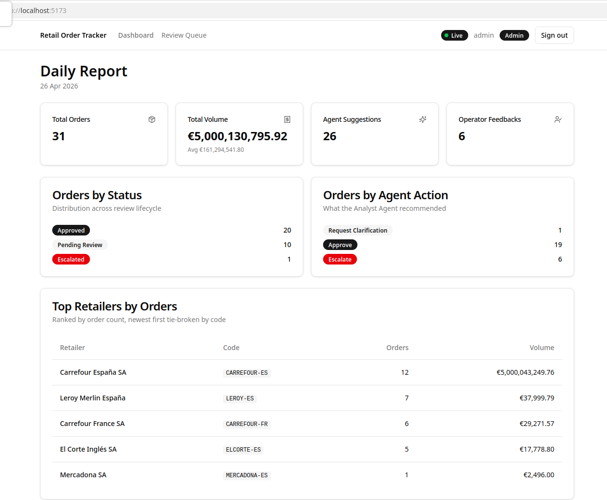
*Home view at http://localhost:5173 — 4 KPI cards (total orders, total volume + average, agent suggestions, operator feedbacks), 2 breakdown cards (status, agent action), and a top-retailers table. All data driven by `GET /api/reports/daily`.*

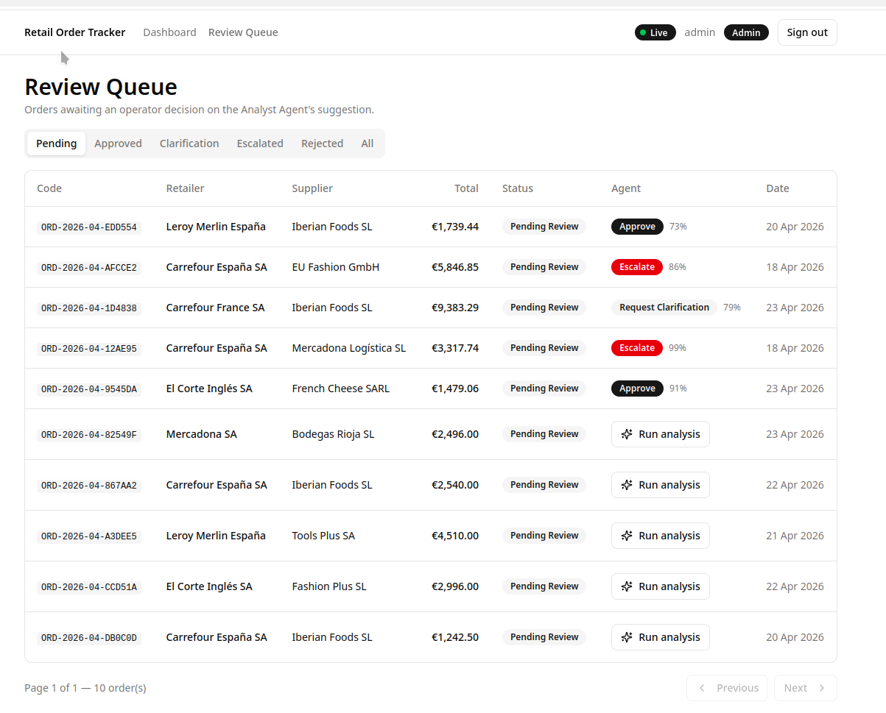
*Review Queue at http://localhost:5173/orders — tabs filter by status (Pending by default), the table shows status + agent-action badges + suggestion confidence, and clicking a row drills into the detail.*

---

## Convenience Scripts

All scripts run from the repo root.

| Script | Purpose |
|---|---|
| **Stack lifecycle** | |
| `npm run dc:up` | Start the full 8-container stack |
| `npm run dc:up:infra` | Start the 4 infra containers only (Postgres, MinIO, Phoenix, n8n) |
| `npm run dc:down` / `dc:down:infra` | Stop the corresponding stack |
| `npm run dc:clean` | Stop the full stack **and remove volumes** (destructive — wipes Postgres + MinIO + Phoenix data) |
| `npm run dc:ps` / `dc:ps:infra` | List running containers |
| `npm run dc:logs` | Tail logs from all services |
| `npm run dc:logs:{api,web,pg,minio,phoenix,n8n}` | Tail one service |
| `npm run dc:build` / `dc:rebuild` | Build (or rebuild without cache) the API + web images |
| **Backend** | |
| `npm run api` | FastAPI dev server with hot reload (host mode, requires venv) |
| `npm run api:test` | Run pytest (110 tests) |
| `npm run api:lint` / `api:lint:fix` | ruff check / fix |
| `npm run api:migrate` | `alembic upgrade head` against the local Postgres |
| **Frontend** | |
| `npm run web` | Vite dev server |
| `npm run web:test` | Vitest single run (24 tests) |
| `npm run web:lint` | ESLint flat config |
| **Demo helpers** (see [scripts/](scripts/)) | |
| `npm run initial-seed` | Wipe + seed the DB (small batch by default; override with `HIST=… PEND=… FB=…`) |
| `npm run demo:upload` | Upload an anomalous JSON order — guaranteed `escalate` candidate when analysed |
| `npm run demo:rerun [orderId]` | Fire n8n workflow **01** to re-run the Analyst Agent (auto-picks the most recent pending-without-suggestion if no id given) |
| `npm run demo:escalation [orderCode] [reason]` | Fire n8n workflow **03** for a mock supervisor ticket (auto-picks the most recent escalated order if no code given) |
| `npm run demo:export [limit]` | Fire n8n workflow **04** to pull a Phoenix dataset (limit defaults to 100) |

The four `demo:*` scripts share [scripts/_common.sh](scripts/_common.sh) — color helpers, admin login, and an `n8n_webhook_post` wrapper that surfaces a clear "workflow is probably not Active" message instead of a raw 404 when an n8n workflow needs activation in the UI first.

---

## Multi-Format Ingestion

A single endpoint, `POST /api/orders` (multipart upload), accepts files in five formats. Each format has its own deterministic parser; PDFs are the only path that calls Claude.

| Format | Parser | Library | Why this approach |
|---|---|---|---|
| `.json` | `JsonOrderParser` | stdlib `json` | Schemaful — direct mapping |
| `.xml` | `XmlOrderParser` | `lxml` + XPath | Spanish Facturae 3.2.2 invoice → order envelope |
| `.csv` | `CsvOrderParser` | `pandas` | Free-text descriptions tolerated, header sniffing |
| `.edi` | `EdifactOrderParser` | `pydifact` | EDIFACT D.96A `ORDERS` segments → DTO |
| `.pdf` | `PdfOrderParser` → **Parser Agent** | LangChain + Claude (multimodal) | No structure — vision required |

All five parsers implement the same `OrderParser` protocol and return a normalised `OrderDTO` (Pydantic v2). The original file bytes are always uploaded to MinIO under `orders/{order_id}/{filename}` regardless of format, so the document download link in the dashboard works for every order.

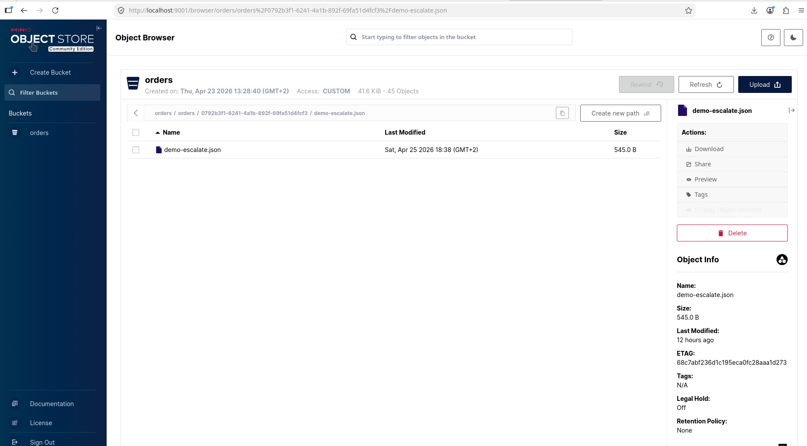
*MinIO console (http://localhost:9001) showing the `orders` bucket — one folder per order id, each holding the original uploaded file.*

Sample files for each format are in [samples/orders/](samples/orders/) and can be POSTed to the API via the recipes in [apps/api/http/orders.http](apps/api/http/orders.http).

---

## AI Agents

Two distinct agents, each with its own prompt template, Phoenix dataset, and evaluator. Both export OpenTelemetry traces to Phoenix on every run.

### Parser Agent — PDF only

| | |
|---|---|
| **Role** | Extract structured data from a PDF |
| **Input** | Raw PDF bytes (multimodal call to Claude vision) |
| **Output** | `OrderDTO` + `parsing_confidence` (0.0–1.0) |
| **Failure mode** | Low confidence → operator manually corrects fields when reviewing the order |
| **Phoenix tags** | `agent_type=parser`, `order_id`, `parsing_confidence` |

### Analyst Agent — every order

| | |
|---|---|
| **Role** | Decide an action on a parsed order |
| **Input** | `OrderDTO` + last 50 orders for the same retailer–supplier pair (price/quantity outlier baseline) |
| **Output** | `{action, confidence, reasoning, anomaliesDetected[]}` via tool calling — Claude picks among `approve_order`, `request_clarification`, `escalate_order` |
| **Why tool calling** | Three tools means Claude commits to one action up-front instead of free-text where the parser would have to extract intent |
| **Phoenix tags** | `agent_type=analyst`, `order_id`, `confidence`, `final_tool` |

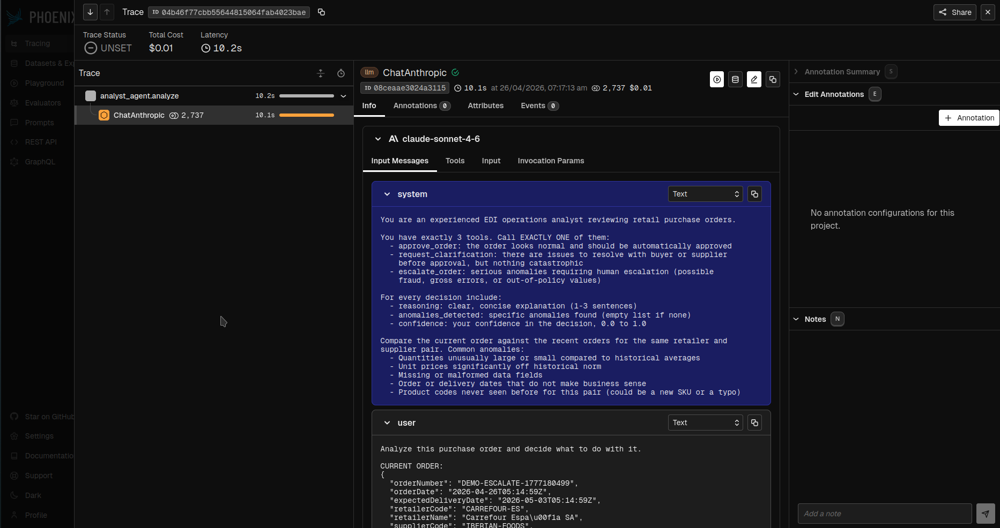
*Phoenix UI (http://localhost:6006) showing an Analyst Agent run on the seeded €1.35M Leroy Merlin order — the trace tree exposes the tool-call decision, token usage, and the prompt + completion side by side.*

The Analyst Agent runs **on demand** rather than as part of upload. There are three entry points:

- **From the Review Queue** — every pending order without a suggestion shows a `Run analysis` button. Clicking it calls `POST /api/agents/analyst/run/by-order/{order_id}`, the suggestion appears in the table when it returns, and the WebSocket broadcasts the change to other operators.
- **Programmatically** via `POST /api/agents/analyst/run/by-order/{order_id}` (the same endpoint the n8n `01 — New Order — Analyst Agent Trigger` workflow targets — useful for replaying a batch).
- **Stateless** via `POST /api/agents/analyst/run` (DTO in, suggestion out, **nothing persisted** — useful for ad-hoc evaluation runs).

Why on-demand and not inline-on-upload? Three reasons: (1) `POST /api/orders` returns in ~100 ms instead of ~10–15 s, (2) tokens are spent only on orders an operator actually intends to triage, (3) failed runs (Anthropic 429, network timeout) are trivially retried by clicking the button again — no half-state to clean up.

---

## HITL Review Loop

The whole point of the platform: **every operator decision becomes a labelled example.**

1. Operator opens the **Review Queue** at http://localhost:5173/orders, filtered to **Pending** by default.
2. They click an order and see the Analyst Agent's suggested action + confidence + reasoning + detected anomalies.
3. The "Review suggestion" dialog pre-populates `final_action` with the agent's recommendation, so accepting is one click.
4. The operator picks one of three decisions:
   - **Accept** — the agent was right; `final_action` stays as suggested
   - **Modify** — the agent was directionally right but the action needs to change (e.g. agent said `escalate`, operator chooses `request_clarification`)
   - **Reject** — the agent was wrong; operator picks the correct action manually
5. On submit, `POST /api/feedback` writes a `feedback` row (with `operator_decision`, `final_action`, `operator_reason`) and transitions the order's status (`pending_review` → `approved` / `clarification_requested` / `escalated` / `rejected_by_operator`).
6. A WebSocket broadcast fires (`order.status_changed`) so other operators see the change live.

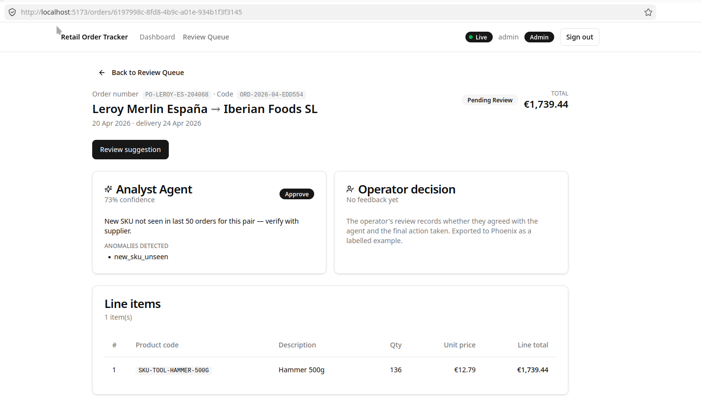
*Order detail page — Analyst Agent card on the left (action + confidence + reasoning + anomaly chips), Operator decision card on the right (post-submit), original document download link, and the line items table.*

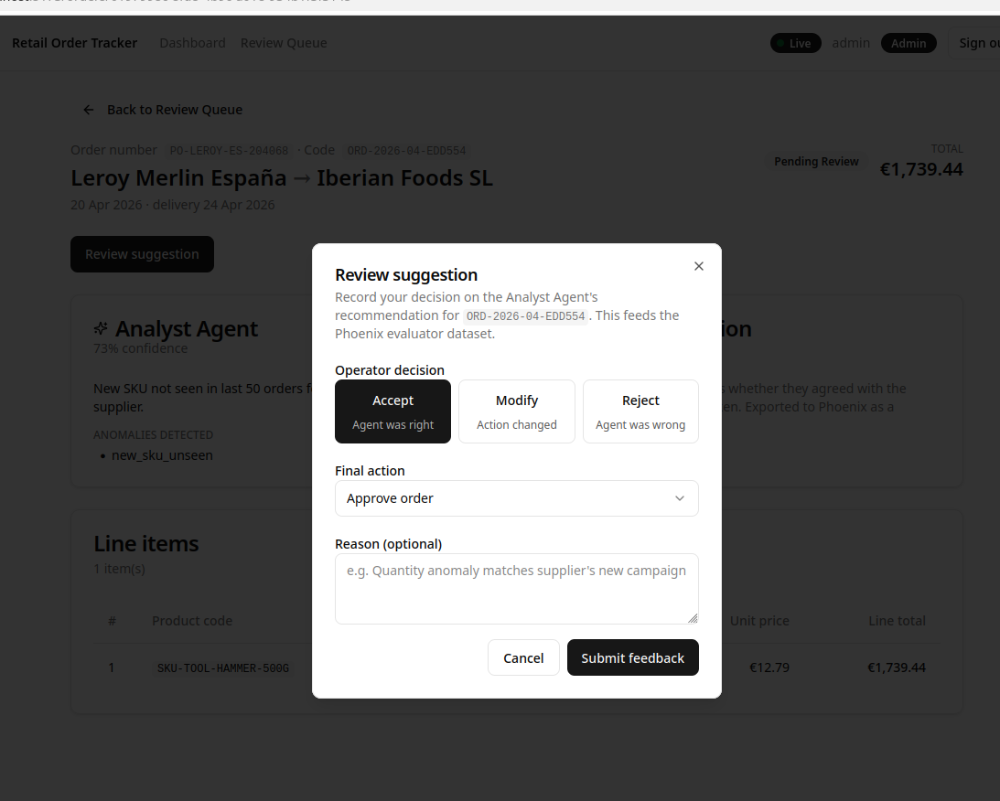
*The feedback dialog with `Modify` selected and a different `final_action` chosen — the optional reason field accepts free text and is exported to Phoenix as the human label.*

---

## Phoenix Observability

Phoenix is **self-hosted** (single container, persistent volume) — no traces leave the environment. Every agent run exports an OTLP trace tagged with `order_id`, `agent_type`, and `confidence`.

The dataset export endpoint (`POST /api/datasets/export`, admin only) joins recent feedbacks + agent suggestions + orders, runs each example through a custom evaluator, and produces a Phoenix-shaped JSON dataset suitable for upload.

### Analyst evaluator

```python
# Per-example
aligned: bool                          # operator_decision == "accepted"
high_confidence_override: bool         # confidence > 0.9 AND operator_decision != "accepted"

# Per batch
decision_alignment: float              # share of "accepted" over total
high_confidence_override_count: int    # examples where the agent was very sure but wrong
```

### Parser evaluator (future)

```python
# Per-example (when operator corrects PDF-extracted fields)
field_accuracy: float                  # 1 - (corrected_fields / total_fields)
overconfidence: bool                   # parsing_confidence > 0.8 AND corrected_fields > 2
```

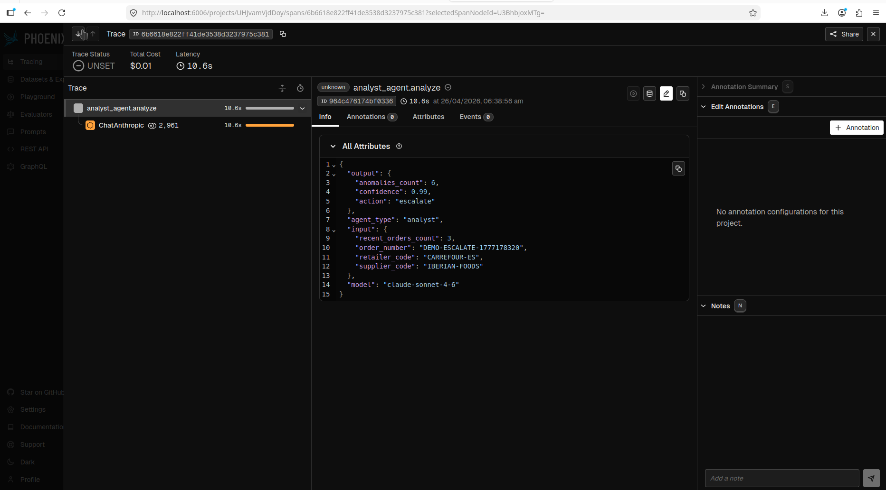
*A Parser Agent trace — multimodal Claude call, latency breakdown, `parsing_confidence` attribute attached to the root span.*

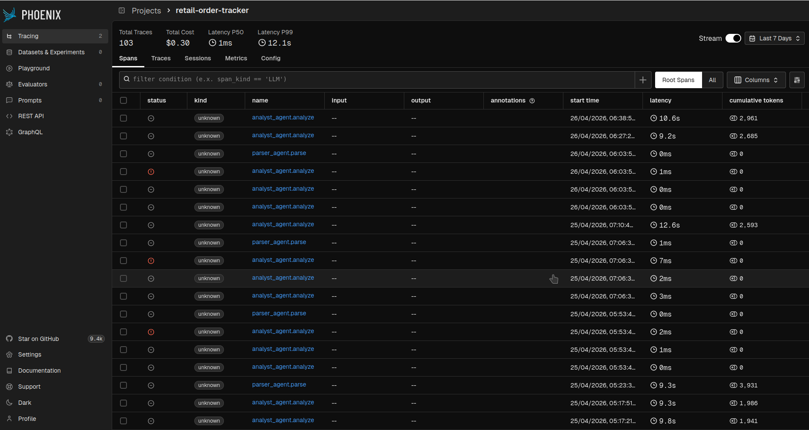
*A labelled dataset after `POST /api/datasets/export?limit=20` — each row carries the operator's verdict, the agent's confidence, and the alignment flag, ready for fine-tuning or regression evaluation.*

The **04 — Retraining** n8n workflow can be triggered manually to re-export the dataset on demand. Once exported, each `feedback` row is marked `phoenix_label_exported=True` to prevent double-counting on subsequent exports.

---

## n8n Workflows

n8n is a **pure orchestrator** — it never calls Claude directly. All AI work happens in the FastAPI backend; n8n only sequences HTTP calls. This keeps prompts, evaluators, and observability in one place.

| # | Workflow | Trigger | What it does |
|---|---|---|---|
| **01** | **New Order — Analyst Agent Trigger** | Webhook `POST /webhook/new-order {orderId}` | Logs in as admin → calls `POST /api/agents/analyst/run/by-order/{orderId}` → persists a fresh suggestion. Demonstrates how an external system would re-trigger analysis (e.g. after a bulk import). |
| **02** | **Daily Anomaly Report** | Cron (08:00 Europe/Madrid) | Calls `GET /api/reports/daily` for yesterday → formats markdown digest → mock email/Slack send. |
| **03** | **Escalation — Notify Supervisor** | Webhook `POST /webhook/escalation {orderId}` | Receives an order id, fetches it, posts a "supervisor ticket" payload (mock — the JSON is logged). |
| **04** | **Retraining — Export Phoenix Dataset** | Manual webhook | Calls `POST /api/datasets/export` → returns the JSON to the executor. Stand-in for a "click to push to Phoenix dataset" admin action. |

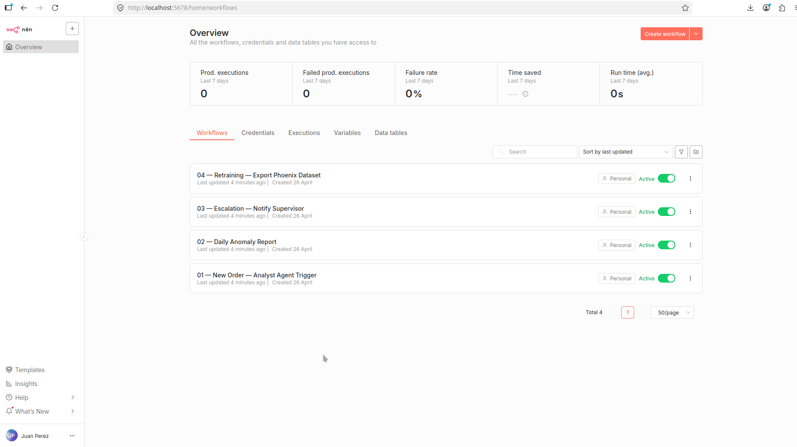
*All 4 workflows imported automatically by `n8n-init` on first compose-up — no manual import needed.*

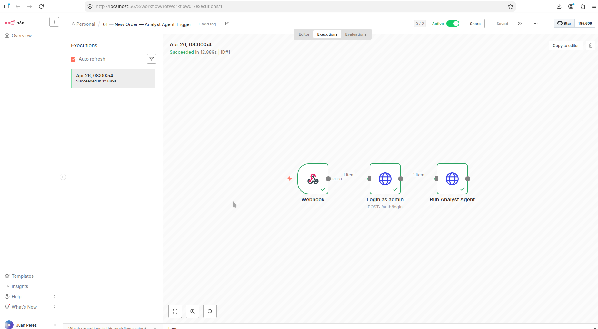
*Workflow 01 executing on the seeded €1.35M order — Webhook → Login → Run Analyst Agent (~11s end-to-end), all green.*

### How auto-import works

`n8n-init` is a one-shot container that runs `n8n import:workflow --input=/workflows/<file>.json` for each file in `n8n/workflows/`. The JSONs include a top-level `id` field (NOT NULL constraint in n8n's `workflow_entity` table) and remove the `tags` arrays (n8n's `workflow_tags` table requires `{id, name}` objects, which would force you to pre-create tags).

Workflows are auto-deactivated on import — open the n8n UI, toggle "Active" on the ones you want to run, and they'll respond to webhooks/crons.

### Testing the webhooks

Each webhook-triggered workflow has a matching `npm run demo:*` helper. They handle admin login, basic auth against n8n, JSON body construction, and friendly error messages (e.g. "the workflow is probably not Active" on 404).

```bash
npm run demo:rerun        # workflow 01 — re-run Analyst Agent on a pending order
npm run demo:escalation   # workflow 03 — mock supervisor ticket
npm run demo:export       # workflow 04 — Phoenix dataset export
```

All three accept optional positional args (orderId / orderCode + reason / limit) and share [scripts/_common.sh](scripts/_common.sh) so credentials, URLs, and color output stay consistent. Override defaults via env: `API_URL=http://api:8000 N8N_USER=foo N8N_PASSWORD=bar npm run demo:escalation`.

---

## Real-Time WebSocket

A single app-wide WebSocket connection lives at `ws://localhost:8000/ws/orders?token=<jwt>`. The frontend's `useOrdersWebSocket` composable opens it once when the auth store has a token, closes it on logout, and auto-reconnects with infinite retries on transient drops.

The server pushes two event types:

```ts
type OrderEvent =
  | {
      eventType: "order.created";
      orderId: string;
      orderCode: string;
      retailerCode: string;
      retailerName: string;
      supplierCode: string;
      supplierName: string;
      currencyCode: string;
      totalAmount: number;
    }
  | {
      eventType: "order.status_changed";
      orderId: string;
      orderCode: string;
      oldStatus: OrderStatus;
      newStatus: OrderStatus;
      finalAction: AgentAction;
    };
```

On every frame the composable fires a vue-sonner toast (with a "View" deep-link to the order) and invalidates the relevant TanStack Query caches (orders list, order detail, daily report) so the dashboard, queue, and detail page all stay in sync without polling.

The header shows a live `ConnectionBadge` (green "Live" / amber "Connecting…" / red "Offline") so the operator always knows whether the dashboard is current.

---

## API Endpoints

Routes are mounted in [apps/api/src/main.py](apps/api/src/main.py); request/response schemas use Pydantic v2 with `alias_generator=to_camel` so the JSON is camelCase while the Python is snake_case.

| Method | Path | Auth | Description |
|---|---|---|---|
| `GET` | `/health` | none | Liveness probe (used by Docker `HEALTHCHECK`) |
| `POST` | `/auth/login` | none | OAuth2 password form → `{accessToken, tokenType}` |
| `GET` | `/auth/me` | JWT | Current user `{username, email, role}` |
| `POST` | `/api/orders` | JWT | Multipart upload — parses, persists, broadcasts `order.created` |
| `GET` | `/api/orders` | JWT | List with `status`, `retailer_code`, `supplier_code`, pagination |
| `GET` | `/api/orders/{id}` | JWT | Detail incl. line items + suggestion + feedback + document ids |
| `POST` | `/api/agents/analyst/run` | JWT | Stateless: DTO in → suggestion out (nothing persisted) |
| `POST` | `/api/agents/analyst/run/by-order/{id}` | JWT | Re-run on a persisted order; writes a new `agent_suggestion` |
| `POST` | `/api/feedback` | JWT | Submit operator decision; transitions order status |
| `GET` | `/api/documents/{id}` | JWT | Metadata + presigned MinIO URL |
| `GET` | `/api/reports/daily` | JWT | Pandas-aggregated daily snapshot (today by default; `from_date`/`to_date` optional) |
| `POST` | `/api/seed` | JWT (admin) | Synthetic data populator (counts via query params) |
| `POST` | `/api/datasets/export` | JWT (admin) | Phoenix-shaped JSON of recent labelled examples + evaluator scores |
| `WS` | `/ws/orders?token=<jwt>` | JWT (query) | Server pushes `order.created` and `order.status_changed` events |

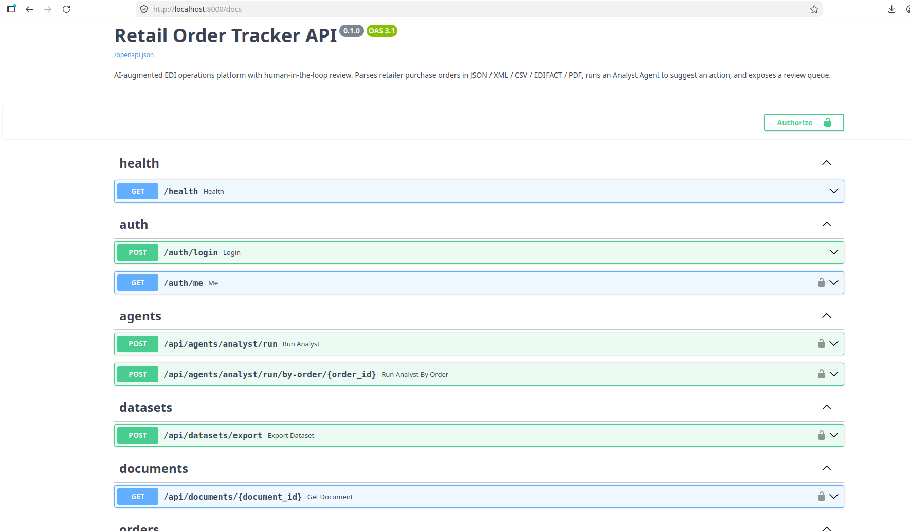
*FastAPI's auto-generated `/docs` page covers every route with request/response schemas. Use the "Authorize" button to paste a JWT once, then exercise the protected endpoints inline.*

For day-to-day testing, the recipes in [apps/api/http/](apps/api/http/) cover every endpoint (login, multipart upload for all 5 formats, agents, feedback, documents, reports, seed, datasets, health). Open them with the VS Code REST Client extension.

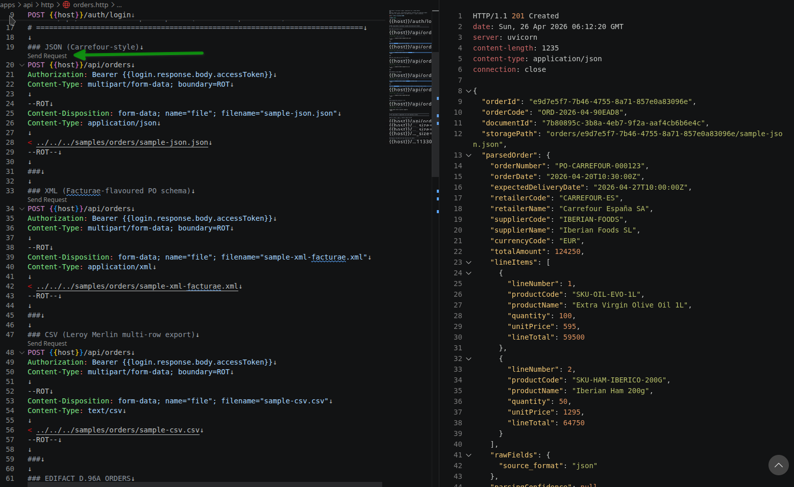
*VS Code REST Client showing `apps/api/http/orders.http` with a `200 OK` response from a multipart upload.*

---

## Testing

### Backend (pytest) — 110 tests

```bash
npm run api:test
```

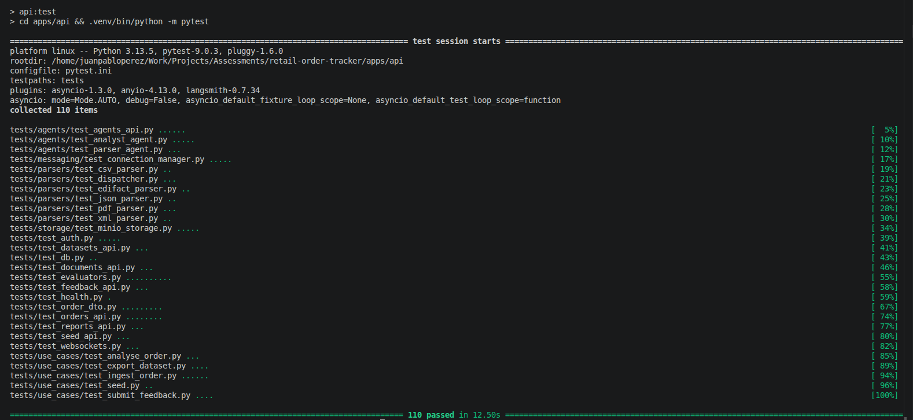

Coverage breakdown:
- **Parsers (×5)** — round-trip a real sample file from `samples/orders/` for each format
- **Use cases** — `IngestOrderUseCase`, `RunAnalystAgent`, `SubmitFeedback`, `Seed`, `ExportDataset`
- **Agents** — Analyst Agent contract tests (mocked Claude)
- **API integration** — every router tested with a real Postgres (httpx + ASGITransport, autouse engine.dispose)
- **Domain** — value object invariants, status transition rules

### Frontend (Vitest) — 28 tests across 4 files

```bash
npm run web:test
```

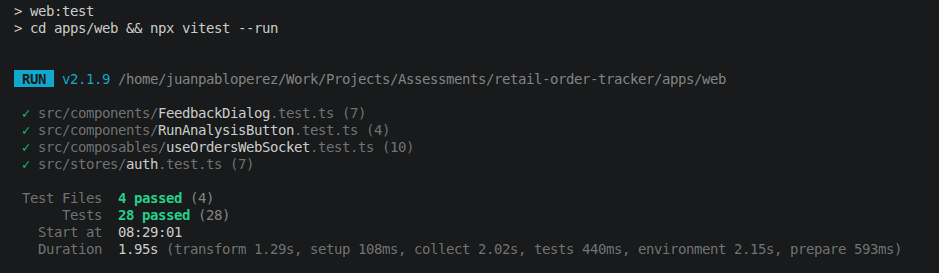

- **`stores/auth.test.ts`** (7) — login persists token + fetches user, logout clears state, `api:unauthorized` event triggers logout, localStorage rehydrate
- **`components/FeedbackDialog.test.ts`** (7) — suggestion-driven default, decision toggle, submit payload (with whitespace trimmed), null reason when textarea empty, `ApiError` rendered, pending state disables submit
- **`components/RunAnalysisButton.test.ts`** (4) — idle vs pending labels, success path emits `completed` + fires success toast + calls `stopPropagation` (so the row click doesn't drill in), `ApiError` path fires error toast and skips the emit
- **`composables/useOrdersWebSocket.test.ts`** (6) — `order.created` and `order.status_changed` dispatch correct toasts and invalidate the right query keys; malformed/unknown frames are dropped silently

### Testing approach

- Backend uses **a real Postgres** via the infra compose (no Testcontainers — kept dependencies minimal). Tests autouse-`engine.dispose()` between modules to avoid the pytest-asyncio engine-reuse pitfall.
- Frontend mocks Radix portal components in jsdom (the real ones rely on `pointerEvents` coercion that jsdom doesn't ship). Module-level mocks for `@vueuse/core`, `vue-sonner`, `vue-router`, `@tanstack/vue-query` keep the WebSocket tests deterministic.

---

## Project Structure

```
retail-order-tracker/
├── apps/
│   ├── api/                          # FastAPI backend (Python 3.13)
│   │   ├── alembic/versions/         # 0001_initial_schema, 0002_seed_reference_data
│   │   ├── http/                     # 9 VS Code REST Client recipe files
│   │   ├── scripts/entrypoint.sh     # Container ENTRYPOINT — alembic + fastapi run
│   │   ├── src/
│   │   │   ├── domain/               # Entities, value objects, enums (zero deps)
│   │   │   ├── application/          # Use cases + abstract ports + DTOs
│   │   │   ├── infrastructure/
│   │   │   │   ├── parsers/          # 5 parsers + dispatcher
│   │   │   │   ├── agents/           # Parser Agent + Analyst Agent (LangChain)
│   │   │   │   ├── storage/          # MinIO adapter
│   │   │   │   ├── persistence/      # SQLAlchemy models, session factory
│   │   │   │   ├── messaging/        # In-memory WS broadcaster
│   │   │   │   └── observability/    # Phoenix OTLP setup
│   │   │   ├── api/                  # FastAPI routers + JWT deps + WS handler
│   │   │   ├── config.py             # Pydantic Settings (env-driven)
│   │   │   └── main.py
│   │   ├── tests/                    # 110 pytest tests
│   │   ├── Dockerfile                # uv-based, alembic on entrypoint
│   │   ├── alembic.ini, pytest.ini, ruff.toml, requirements.txt
│   ├── web/                          # Vue 3 frontend
│   │   ├── src/
│   │   │   ├── components/           # FeedbackDialog, RunAnalysisButton, ConnectionBadge, ui/ (shadcn-vue)
│   │   │   ├── composables/          # useOrdersWebSocket
│   │   │   ├── lib/                  # api.ts, format.ts, utils.ts
│   │   │   ├── router/               # Vue Router 4 + auth guard
│   │   │   ├── services/             # TanStack Query hooks (orders, reports, feedback, documents, agents)
│   │   │   ├── stores/               # Pinia auth store
│   │   │   ├── test/setup.ts         # jsdom shims (ResizeObserver, matchMedia, …)
│   │   │   ├── types/api.ts          # Backend response types (camelCase)
│   │   │   └── views/                # LoginView, HomeView, OrdersQueueView, OrderDetailView
│   │   ├── Dockerfile                # Multi-stage Node → nginx
│   │   ├── nginx.conf                # SPA fallback + asset caching
│   │   ├── eslint.config.js          # ESLint 9 flat config
│   │   ├── components.json           # shadcn-vue config
│   │   ├── vite.config.ts            # Vite build config
│   │   └── vitest.config.ts          # Vitest config (extends vite.config.ts)
├── n8n/workflows/                    # 4 exported workflow JSONs (auto-imported)
├── samples/orders/                   # One sample file per format (5 total)
├── infra/postgres/init/              # Initial SQL (creates n8n's database)
├── scripts/                          # initial-seed + demo-{upload,new-order,escalation,export-dataset} + n8n import + sample-PDF generator
├── docker-compose.yml                # Full 8-container stack
├── docker-compose.infra.yml          # Infra-only (4 + 1 init) for host-mode dev
├── CLAUDE.md                         # Project conventions for AI agents
├── .env.example                      # All settings documented
└── package.json                      # Root convenience scripts
```

---

## Assumptions

- **Demo scope** — single-tenant, in-memory user store, JWT only (no refresh tokens), Postgres + MinIO not replicated. Production would replace each of these.
- **Madrid timezone** for everything operator-facing. UTC inside the database; `Europe/Madrid` only at presentation time.
- **All monetary amounts are minor units (integer cents)**, never floats. Currency conversion is out of scope — orders are denominated in their original currency throughout.
- **Soft delete only** (`disabled_at` nullable timestamp). No hard deletes, no GDPR right-to-erasure tooling.
- **Code generation** — `ORD-YYYY-MM-NNNNNN` for orders, `DOC-...` for documents. Sequence is per month, monotonic per Postgres sequence.
- **Phoenix is local-only** — no Phoenix Cloud, no auth on the Phoenix UI. Acceptable for a demo, never for production.
- **The Analyst Agent runs on demand**, not as part of `POST /api/orders`. Operators trigger it from the Review Queue (per-row button) or via `POST /api/agents/analyst/run/by-order/{id}`. This keeps uploads fast and Claude-token spend tied to operator intent. Production with high-volume ingestion would batch-trigger the agent via a queue + worker instead.

---

## Decisions Postponed

- **Refresh tokens / token rotation** — current JWT is 60-min absolute, no sliding session
- **Role-based access at the field level** — admin/operator distinction exists but operators can see *every* order, not just orders for retailers they own
- **Testcontainers** — backend tests use a long-running Postgres container shared with dev; switching to Testcontainers would isolate but slow CI
- **End-to-end (Playwright) tests** — the Vitest layer covers components, but a real-browser flow over the full stack is not yet wired up
- **Idempotency keys on `POST /api/orders`** — the same file uploaded twice creates two orders today
- **Pagination cursors** — list endpoints use offset pagination, which drifts under concurrent inserts
- **Audit log table** — feedback rows record decisions but not arbitrary actions (e.g. who re-ran the analyst on an order)

---

## What I Would Do Differently

- **Background-process the Analyst Agent** — sync ingestion was easier to demo (suggestion is part of the upload response) but couples request latency to LLM latency. A small queue (Redis Streams + a worker container) would let `POST /api/orders` return 202 with a placeholder suggestion id, and the WebSocket would push the real suggestion when ready.
- **Single AI parser instead of pluggable parsers, given more time** — the deterministic parsers won the Phase 3 cost/reliability comparison decisively, but a single multimodal call with a strong schema-validating output parser (Pydantic via tool calling) would shrink five files into one. The trade-off is opacity when something goes wrong.
- **Drop Pinia and use TanStack Query for auth too** — the auth store is one of the few places where Pinia earns its keep (cross-component reactive token + 401 listener), but the line between server state and client state blurs. Could collapse to a single `useAuth()` query with `staleTime: Infinity`.
- **Write n8n workflows as code** — the JSON exports work but they're hard to diff. n8n's `n8n_io` import format would let workflows live next to migrations.
- **Use Phoenix's evaluator UI instead of computing scores in the API** — `dataset_export` does the alignment check inline today; pushing that to a Phoenix evaluator (which Phoenix runs on a schedule) decouples evaluation from the HTTP path.

---

## How to Extend for Production

| Concern | Today | Production change |
|---|---|---|
| **Identity** | JWT, in-memory user store | Managed IdP (Keycloak / Auth0 / Cognito), OIDC, refresh tokens, MFA |
| **Object storage** | MinIO container, single host | AWS S3 / GCS / Azure Blob, lifecycle policies, virus scanning |
| **Database** | Single Postgres container | Managed Postgres (RDS / Cloud SQL), read replica, point-in-time restore |
| **Observability** | Self-hosted Phoenix, no auth | Phoenix Cloud or LangSmith, OpenTelemetry collector, retention policy |
| **Secrets** | `.env` file | Vault / AWS SM / GCP Secret Manager |
| **AI provider** | Anthropic only | Multi-provider with fallback (Anthropic → OpenAI → Gemini), cost-aware routing |
| **Queue** | Synchronous agent calls | Redis Streams / NATS / SQS + dedicated worker pool |
| **Realtime** | In-memory WS broadcaster (single-process) | Redis Pub/Sub or NATS for multi-replica fan-out |
| **Frontend hosting** | nginx in Compose | CDN (Cloudflare / CloudFront) + SPA on object storage |
| **CI/CD** | Manual `docker compose build` | GitHub Actions → ECR/GCR → ArgoCD or Flux for k8s |
| **Error monitoring** | Logs only | Sentry (frontend + backend) with release tagging |

---

## Trade-offs

| Decision | Trade-off |
|---|---|
| **Phoenix over LangSmith** | Open-source, self-hosted, no data leaves the environment. LangSmith is better when you want a managed cloud with team collaboration features. |
| **Pluggable parsers over single AI parser** | Deterministic parsers for structured formats (JSON/XML/CSV/EDIFACT) are faster, cheaper, and more reliable than AI. Claude is only used where structure is missing (PDF). |
| **Two agents (Parser + Analyst) over one** | Different prompt templates, different evaluation datasets, different failure modes. Cost: slightly more code and two Phoenix datasets to maintain. |
| **MinIO over local filesystem** | S3-compatible API means the same code works in production (AWS S3 / GCS / Azure Blob). Cost: one extra container in dev. |
| **Tool calling over linear chain (Analyst Agent)** | Claude commits to one of three actions up-front instead of generating free-text the parser would have to interpret. Cost: slightly more complex prompt design. |
| **n8n orchestration over inline orchestration** | Workflow logic (cron schedules, webhook fan-out) is decoupled from the API. Reviewers can tweak schedules in the UI without rebuilding. Cost: one more moving part. |
| **Vue 3 over React** | Portfolio diversification — sister assessments use React or Angular. Composition API + Pinia + TanStack Query is the modern equivalent. |
| **Alembic migrations over `create_all`** | Production discipline — every schema change is versioned and reviewable. Cost: extra tooling for newcomers. |
| **HITL async over sync** | Operators review when they can, not under the agent's wait. Models real EDI operations, where backlogs exist. |
| **JWT simple over Keycloak/Auth0** | Assessment scope. Production replaces with managed IdP for refresh tokens, OIDC, role-based access. |
| **Single Postgres over per-service DBs** | Simpler for one backend service. Splitting Analytics into its own service would justify a separate DB. |
| **`mirror.gcr.io/library` default** | Dodges the LaLiga / Cloudflare R2 block Spanish ISPs apply during football matches, and Docker Hub rate limits in CI. Override with `BASE_REGISTRY=docker.io/library` if you prefer the canonical source. |

---

## AI Tools Used

This project was built with **Claude Code** as a pair-programming partner:

- All Python and TypeScript modules drafted with Claude, then reviewed + edited by hand.
- LangChain prompts, Phoenix attributes, and the tool-calling schema for the Analyst Agent iterated together with Claude — multiple rounds of "what's confusing about this prompt to a model" before settling.
- The `samples/orders/sample-pdf.pdf` was generated from a Python script ([scripts/generate_sample_pdf.py](scripts/generate_sample_pdf.py)) Claude wrote so the PDF parser had a non-trivial test fixture (logo + table + free-text shipping notes).
- This README, the Phase 9 plan, and CLAUDE.md were drafted by Claude and edited.

The platform is, of course, also a Claude *user* — the Parser and Analyst agents both call `claude-sonnet-4-6`. The whole point of the project is the loop: Claude makes a suggestion, an operator labels it, Phoenix tracks alignment, the labelled examples come back as a Phoenix dataset, and the prompt improves the next iteration.
